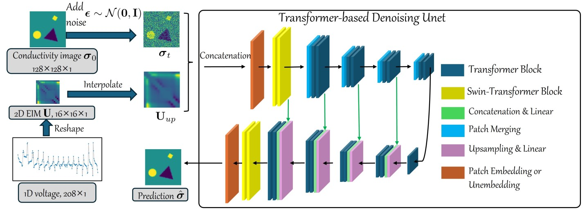

## A Conditional Diffusion Model for Electrical Impedance Tomography Image Reconstruction  
The code in this toolbox implements the "[A Conditional Diffusion Model for Electrical Impedance Tomography Image Reconstruction]([https://arxiv.org/abs/2412.16979](https://ieeexplore.ieee.org/document/10922741))". More specifically, it is detailed as follow.




## Training

- **Simulated data:** The EIDORS generated dataset is at [dataset](https://drive.google.com/file/d/1pNSEdf3nxn809pkFCoHGuSydcU9yT7Pw/view?usp=drive_link)

  - **Data generation:** Follow the setting from [Weighted SBL](https://github.com/chdim100/Weighted-Sparse-Bayesian-Learning-for-Electrical-Impedance-Tomography/blob/main/Src/Main.m)

- **Real-world data:** Two real-world data can be downloaded from [UEF2017](https://fips.fi/open-datasets/eit-datasets/2d-electrical-impedance-tomography-dataset/) for the 2D electrical impedance tomography dataset collected by the Finnish Inverse Problems Society at the University of Eastern Finland in 2017 (UEF2017) and [KTC2023](https://zenodo.org/records/8252370) for the Kuopio Tomography Challenge 2023.

  The real data has been placed in the `./data/` in the appropriate format.

- Put the data at `./data/` and run `python main.py --mode train` on 1 GPU or `accelerate launch main.py --mode train` on multi-GPUs machine

- **Data format*:* The data was stored in npz format which contains `ys` as the voltage vector, `xs` as the true value of conductivity, `xs_gn` as the conductivity predicted by the Gauss-Newton method and `TR` as the conductivity predicted by the Tikhonov regression.

## Test

- The pretraining weight `best.pt` is at [pre-trained weights](https://drive.google.com/file/d/1xOP4PMbGpsgz1e1s3BtHx4cFPfGUnlnn/view?usp=drive_link)
- Download the pretraining weight and put it to `./results/deit/checkpoints`
- Put the test data at `./data/`  and run `python main.py --mode test --data simulated` for EIDORS generated data, `python main.py --mode test --data uef2017` for UEF2017 dataset or `python main.py --mode test --data ktc2023`  for KTC2023 dataset
- The prediction will be at  `./results/deit/checkpoints`

## Citation

**Please kindly cite the papers if this code is useful and helpful for your research.**
```
@ARTICLE{10922741,
  author={Shi, Shuaikai and Kang, Ruiyuan and Liatsis, Panos},
  journal={IEEE Transactions on Instrumentation and Measurement}, 
  title={A Conditional Diffusion Model for Electrical Impedance Tomography Image Reconstruction}, 
  year={2025},
  volume={},
  number={},
  pages={1-1},
  keywords={Conductivity;Image reconstruction;Electrical impedance tomography;Diffusion models;Noise reduction;Accuracy;Training;Inverse problems;Feature extraction;Deep learning;Electrical impedance tomography;image reconstruction;diffusion model;probabilistic model;measurement visualization},
  doi={10.1109/TIM.2025.3550245}}

```

## Acknowledgement

This code is mainly built upon [DiT](https://github.com/facebookresearch/DiT) repositories.

## Contact Information:

If you encounter any bugs while using this code, please do not hesitate to contact us.


Shuaikai Shi [shuaikai.shi@ku.ac.ae] 


